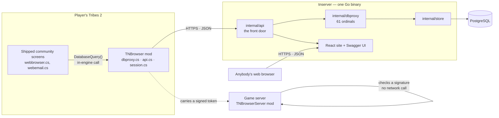
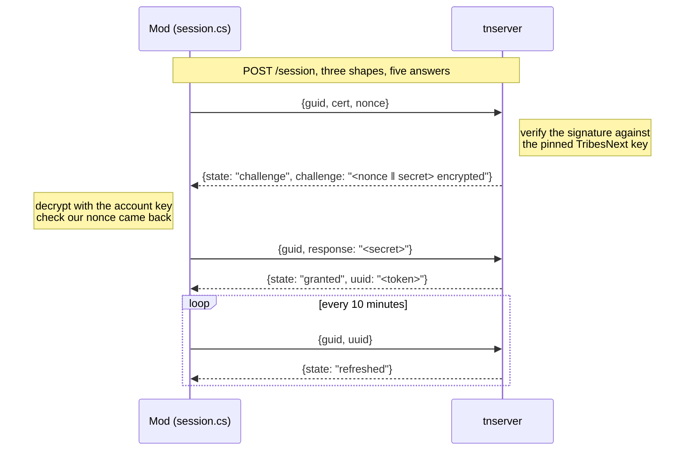
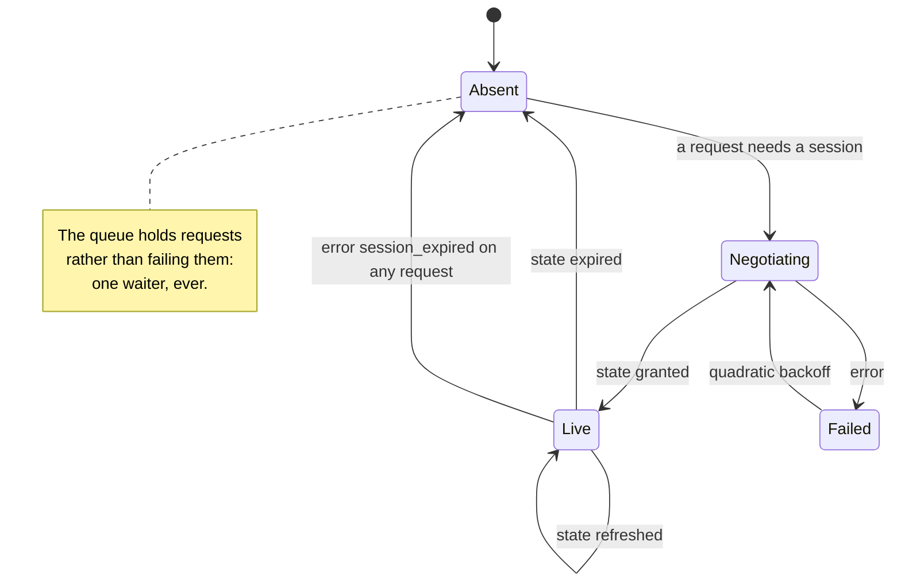
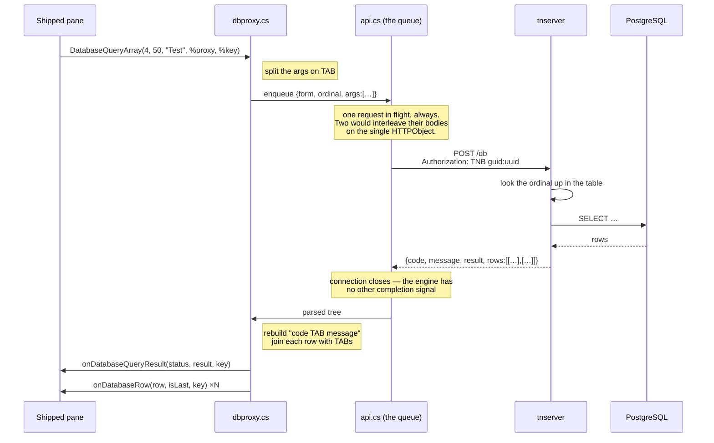
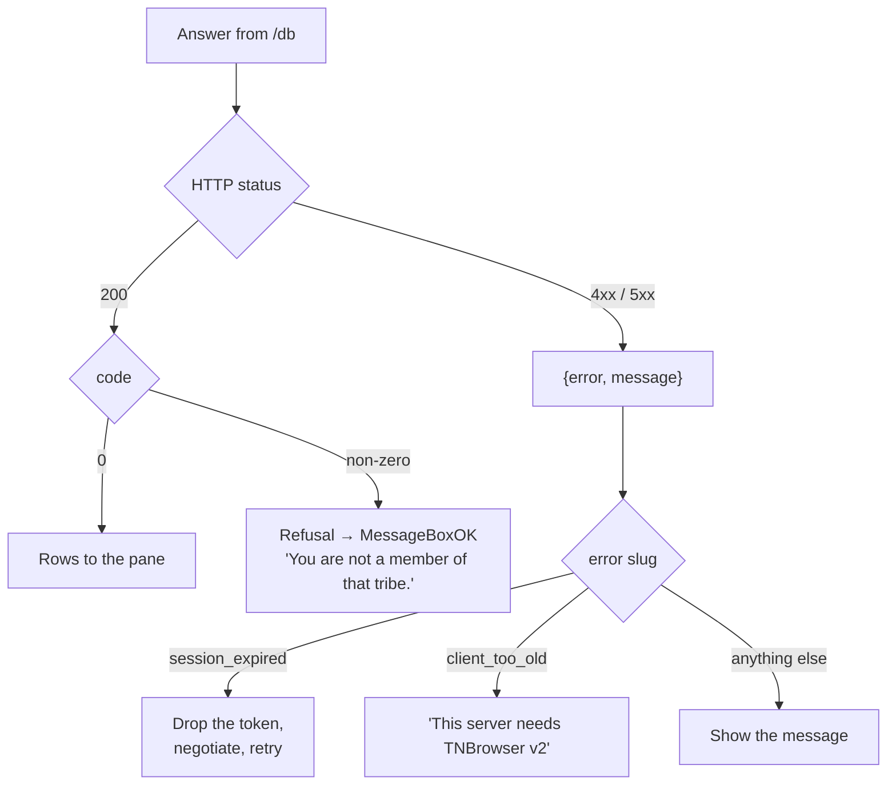
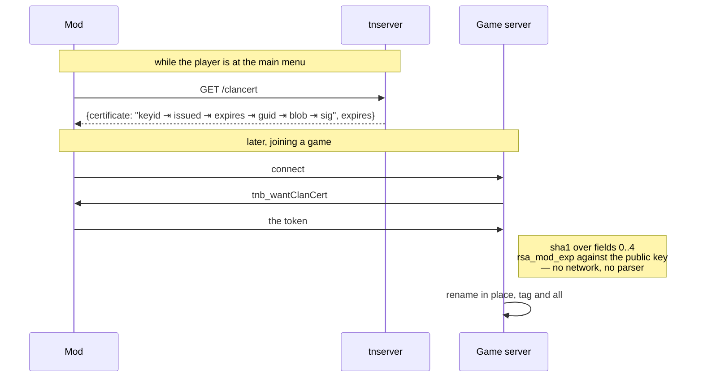
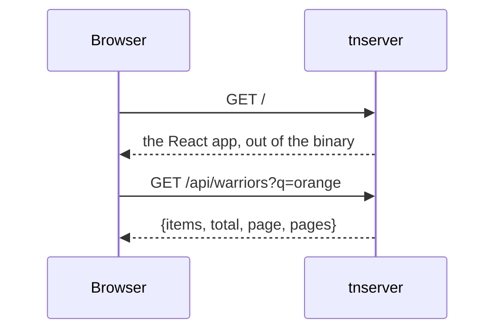

# The protocol

How the mod, the backend and a game server talk to each other, as of **v2.0.0**.

The reference is [`server/apidoc/openapi.yaml`](server/apidoc/openapi.yaml),
served by any deployment at `/api/openapi.yaml` with Swagger UI over it at
`/docs`. This page is the part a specification cannot express: what happens in
what order, and why.

For the protocol this one *replaced* — WON's own, tunnelled over the chat
socket — see [WON_PROTOCOL.md](WON_PROTOCOL.md).

---

## The pieces

Two things worth noticing.

The shipped screens never learn that anything changed: they call
`DatabaseQuery()` exactly as they did against WON, and the mod is what turns
that into HTTP. And the arrow from the mod to the game server is dotted because
it is not a request — the player carries a token, and the game server verifies
it offline.

---

## Authentication

No password is ever typed into the mod, and the backend contacts nobody to
decide who you are.

A TribesNext account is an RSA keypair plus a certificate — name, GUID, public
key, and TribesNext's signature over them. The certificate is public; the client
hands the same one to every game server it joins. So proving the certificate is
yours takes a second step: the server encrypts a challenge with the key inside
it, and only the holder of the private half can read it back.

The nonce is the client's half and it is checked on the way back. Without it the
server could replay an old challenge; with it, a response proves the holder
decrypted *this* exchange.

Consequences, all deliberate:

- **Nothing upstream has to be reachable.** TribesNext could vanish and logins
  here would carry on.
- **There is no revocation.** A certificate is valid forever, so an account
  banned upstream still authenticates here.
- **The token means nothing anywhere else.** It is minted by this server, for
  this server.

### The token's life

`expired` is not an error. A server restart drops the session table, and the
right response is to negotiate a new one — which is what both routes into
`Absent` do.

---

## A query, end to end

This is the path every community pane takes, and the one the project exists for.

Three details in there are load-bearing and easy to undo by accident:

- **One request in flight.** The engine gives each `HTTPObject` a single set of
  callbacks, so two overlapping transfers interleave their response bodies.
- **The connection closes after every answer.** Torque reports a completed
  transfer only as `onDisconnect`. A keep-alive response leaves the queue
  waiting forever on a transfer that already finished.
- **The rows are joined at the very end.** They cross the wire as arrays of
  typed values; the tab-separated string exists for the length of one function
  call, because that is what the shipped parsers index into.

### When it goes wrong

The distinction that matters: **a refusal is a 200**. "You are not a member of
that tribe" is a correct answer to a well-formed question, and the shipped
`onDatabaseQueryResult` already knows how to show it. Only a transport failure
is a 4xx.

---

## How a tribe tag reaches a game server

A game server renders a player's clan tag inside `onConnect`, synchronously,
before the player's name is built. Fetching it over HTTP at that moment would
put a network round trip in the middle of every join.

So it does not. The player carries a token, and the server checks a signature.

**The token is not JSON, and will not become it.** Its signature covers the
literal tab-joined bytes of its first five fields, and the mod that verifies it
does so with `getField`, `sha1sum` and `rsa_mod_exp` — it ships no JSON parser
at all, and putting one on the connect path would spend the latency this design
exists to save. The `/clancert` *response* is JSON around an opaque credential,
the way an OAuth response is JSON around an `access_token`.

Expiry is the only revocation there is, which is why it is short (30 minutes by
default) — it is also what stops a player who has left a tribe from wearing its
tag. A bad signature, an expired token, an unknown key or no token at all all
mean the same thing: a player with no tag. Nothing here can keep anybody out of
a game.

---

## The website

No credentials, and none possible: the endpoints are read-only and expose only
what is on the scoreboard of any server those players join. Mail, buddy lists,
blocks and invitations are not reachable from the website at all.

---

## Why the shapes are what they are

A short list of decisions that look arbitrary until you know what forced them.

| | Why |
|---|---|
| Row fields are positional, not named | A field exists because a shipped script indexes it. `webbrowser.cs:1470` reads field 9; naming it would not stop position 9 mattering. |
| `result` is a string | It is a row count for array queries and a payload for several scalars — the MOTD, a tribe description. Typing it would be a lie with a type on it. |
| `args` is an array | A joined string cannot say whether `"a\t\t"` is two arguments or three, and three ordinals genuinely vary their count. |
| Identity is a header | Every authenticated route then carries it the same way, and the credential stays out of the request line that lands in access logs. |
| Every answer closes the connection | Torque's `HTTPObject` has no completion signal but a closed socket. |
| The clan token is opaque | Its signature covers exact bytes, and its verifier runs on the connect path with no parser. |
| `/session` is its own shape | It runs before anything else works, and its five outcomes each need a different response from the client. |
