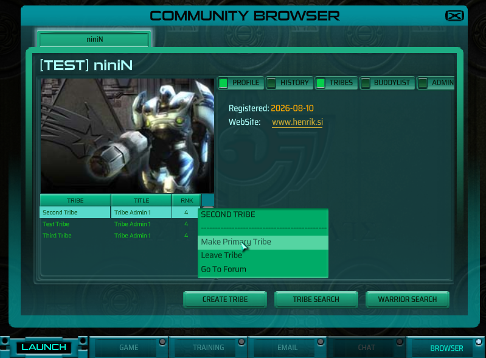
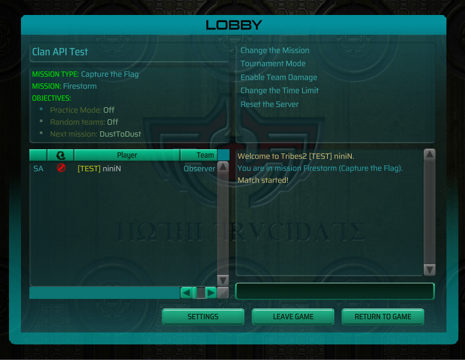
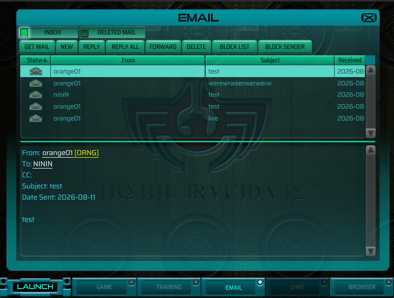

# TNBrowser — Tribes 2's community browser and mail, working again





## What this is

Tribes 2 shipped with in-game community screens: warrior profiles, tribe pages
with rosters and administration, a tribe/warrior search, and mail. They are
still in every install — the BROWSER and EMAIL buttons on the launch shell open
them — but they talked to Sierra's WON backend, which shut down in 2003. So
today those buttons lead to:

> There was an error processing your request, please wait a few moments and try
> again.

This mod makes them work, **without changing a single pixel of them**.

It ships no `.gui` file. Not one. The screens a player sees are the shipped
`EmailGui` and `TribeAndWarriorBrowserGui`, driven by the shipped `webemail.cs`
and `webbrowser.cs`, rendering through the shipped control profiles. What the
mod replaces is the layer underneath: `DatabaseQuery()`, the single call every
community pane makes, re-pointed from WON's dead transport to HTTP against a
backend you run.

That is the whole design, and it is why the screens are identical to vanilla by
construction rather than by careful copying.

## How it works

The shipped scripts reach their backend through exactly two functions:

```
DatabaseQuery(ordinal, args, proxyObject, key)                webstuff.cs:218
DatabaseQueryArray(ordinal, maxRows, args, proxyObject, key)           :223
```

Both are TorqueScript, not native, so replacing them in a package is all it
takes. The original framed each call as `dbqax <id> <ordinal> <maxRows> :<args>`
and pushed it down the WON chat socket; this sends it as one HTTP POST and
delivers the answer back through the client's own path —
`onDatabaseQueryResult` once, then `onDatabaseRow` per row.

The ordinals themselves are unchanged, and that is the point. They were Oracle
stored-procedure selectors — the client tests for `ORA-04061` by name in seven
handlers — and the argument tuples and row schemas belong to the shipped
parsers, not to us. All **61** `(form, ordinal)` pairs reachable from the five
community scripts are implemented, each cited in
`server/internal/dbproxy/ordinals.go` to the call site that issues it and the
handler that reads the answer back.

Deactivating the package restores the shipped behaviour exactly: `DatabaseQuery`
goes back to framing `dbqax`, and `WONGetAuthInfo` goes back to not existing.

### Three findings that made this cheap

Established by reading the extracted `base/scripts.vl2` and probing a running
TribesNext client:

1. **The WON natives are gone, but `WONGetAuthInfo` is not.** `WONLoginIRC`,
   `WONStartLogin` and `IRCGetTriple` answer *"Unable to find function"* — the
   patched binary does not register them, so defining them is the whole job.
   `WONGetAuthInfo` is different: **TribesNext defines it itself**, in
   `t2csri/clientSide.cs:12`, on any client that can go online. Overriding it
   is therefore a real override with a real predecessor — and the predecessor
   did something besides answer. It assigned `$LoginCertificate` on the way
   past, which is the only thing that populates that global on the ordinary
   login path (`loginScreens.cs:339` does too, but only when *creating* an
   account).

   Missing that cost a live bug: a player who really was logged in got *"You
   are not logged in to a TribesNext account"*, because the override removed
   the side effect the session layer was leaning on. It looked absent only
   under `-nologin`, which skips the whole `t2csri` script layer — so the
   original probe was run in the one configuration where the claim happened to
   be true. `TNBSessionGuid` now asks the account subsystem directly, and the
   override falls back to TribesNext's own record layout until the community
   certificate arrives.
2. **Overriding `DatabaseQuery` steps over the chat gate.** `DatabaseQueryi`
   refuses to send anything unless `$IRCClient::state $= IDIRC_CONNECTED`
   (`webstuff.cs:183`) and answers a *fabricated* `1\tORA-04061` when it is
   not. Replacing the two public entry points means nothing here has to talk to
   a chat server.
3. **The shipped `LaunchBrowser` and `LaunchEmail` already do the right
   thing.** Only the launch bar needs a package, to build the online tab set and
   re-enable the three tabs TribesNext switched off.

## Three parts

| | what it is | who needs it |
|---|---|---|
| `TNBrowser/` | the client mod: seven script files, no GUI | every player |
| `server/` | a Go backend answering the 61 ordinals | whoever hosts the community |
| `TNBrowserServer/` | a server-side mod that renders tribe tags into player names | game-server operators |
| `server/web/` | the public website: download the mod, browse the community | anybody with a browser |

The website is served by the same binary and from the same address the mod
talks to, at `/`. It is read-only and needs no login — a warrior name, a tribe
tag and a roster are on the scoreboard of every server those players join, so
there is nothing there to guard. Mail, buddy lists and invitations are not
exposed by it at all.

## Authentication is TribesNext's identity, checked locally

No password is typed into the mod, and nothing contacts TribesNext.

A TribesNext account is an RSA keypair plus a certificate — name, GUID, public
key, and TribesNext's signature over the four fields — and that signature can be
checked by anyone holding the public half of the signing key, which every copy
of `IFC22.dll` carries. So the mod sends its certificate to the backend, the
backend checks the signature and then challenges the client to decrypt something
only the account's private key can read. That is the same exchange a game server
performs on a connecting player, for the same reason: the proof travels with the
player, so the issuer does not have to be online to confirm it.

This used to run through TribesNext twice — the client logged in to their robot
endpoint and the backend asked them whether the resulting token was real — which
made someone else's uptime a condition of anybody using this one. It no longer
does. The trade is that certificates cannot be revoked: an account banned
upstream still authenticates here.

What the backend adds is the last hop: `WONGetAuthInfo()` serves that identity
to the shipped scripts in WON's certificate layout, assembled from the GUID the
signature vouched for.

### Clan tags travel with the player

The same idea, one layer out. A game server renders a clan tag from
`getAuthInfo()` inside `onConnect`, synchronously, so the tag has to be in hand
before the player's name is built. `TNBrowserServer/` used to fetch it over HTTP
while holding the connection open; it now checks a short-lived certificate the
player carries, signed by the backend, and makes no network request of its own.

Getting it in hand that early is the hard part, because a client asked for its
certificate during TribesNext's authentication phase does not answer — measured
both ways on a live server. So the server asks again the moment the connection
is established, and applies what comes back by renaming in place: the server's
tagged string, the client target, and a `MsgClientNameChanged` that updates the
player list every machine built at join. That is the same three-step rename
stock performs when two players collide on a name, and it completes while the
player is still loading in.

TribesNext shipped this feature and it has been dead for years: its certificates
are verified through a delegated key whose own certificate expired and can only
be renewed by its author. Skipping that chain costs nothing here — it exists so
that an arbitrary community server can convince an arbitrary game server, and
our issuer and verifier are the same project. What genuinely needs an outside
authority, that a GUID belongs to a real account, is exactly what the account
certificate already says, and the game server has checked it a moment earlier.

Nothing in this path can keep somebody out of a game. A bad signature, a lapsed
certificate, an unknown key, a client that does not run the mod: all of them
mean a player with no tag. The shipped equivalent disconnects for every one of
those, and for a fifth case besides — an issuer the server cannot resolve, which
stalls until a 15-second timer drops the player with a message telling them to
install the patch they are already running.

## Requirements

- A **TribesNext-patched client**, for the `HTTPObject` reimplemented on libcurl
  (stock Torque's speaks plain HTTP only) and the RSA login.
- **This backend.** TribesNext's own server cannot serve the mod any more: it
  speaks methods and JSON objects, not ordinals and rows. That is the price of
  running the shipped screens.

## Installing

Each release points at `https://tnb.k8s.henrik.si` and has the address already
baked in — [TNBrowser.vl2][dl-client] for players, [TNBrowserServer.vl2][dl-server]
for game-server operators. The download page at
[tnb.k8s.henrik.si](https://tnb.k8s.henrik.si/) names the current one and links
to both.

[dl-client]: https://github.com/henrikhasell/TribesNextBrowser/releases/latest/download/TNBrowser.vl2
[dl-server]: https://github.com/henrikhasell/TribesNextBrowser/releases/latest/download/TNBrowserServer.vl2

Those links follow GitHub's pointer at the newest release, and a published
release is never rewritten — so a link to a particular version keeps handing out
the bytes it was recorded for.

### Cutting a release

A release is a tag, and only a tag: nothing is published for a push to `main`.

```sh
# 1. Bump release.DefaultTag in server/internal/release/release.go to match,
#    so the website can still name the version when GitHub is unreachable.
# 2. Commit that, then:
git tag -a v1.2.0 -m "What changed"
git push origin v1.2.0
```

`.github/workflows/vl2.yml` builds both archives on the tag and attaches them to
a release of that name. This used to fire on every merge, which made "the newest
build" and "the version we mean" two different things and gave players a list of
releases nobody had decided to ship.

For any other backend, build your own:

```sh
./tools/build-vl2.sh --host "http://your-backend:8080"
cp dist/TNBrowser.vl2 <Tribes2>/GameData/MyMod/
```

then launch with `-mod MyMod`. The engine indexes a mod directory's `.vl2`
archives alongside its loose files, so nothing needs unpacking. Settings can
also go in a loose `autoexec.cs` beside the archive — the game execs that last,
so a plain `$TNB::Host = "...";` overrides a baked value.

Builds are reproducible: every archive entry is stamped with the last commit's
date, so rebuilding unchanged sources produces an identical file.

To try a build the way a player runs it — on screen, logged in, with the
package installed into `Classic` — `./tools/run-live-client.sh` puts one in a
throwaway container pointed at the live backend.

## What works

Everything the two rendering panes can reach:

- **Warrior profiles** — description, URL, graphic, registration date, online
  state, tribe list, history, buddy list.
- **Tribes** — profile, roster, invitations, create, disband, description, tag,
  graphic, recruiting flag, member ranks and titles, kick, leave, primary tribe.
- **Invitations and join requests**, delivered *by mail* with working Accept and
  Reject links. That is not a design choice: the client has no query that lists
  a player's own invitations, so mail is the only channel there is.
- **Mail** — inbox, deleted folder, compose, reply, delete, permanent removal,
  read markers, and the block list with a count of what each block has actually
  turned away.
- **Search** for warriors and tribes, from the browser and the mail address
  book.

The first time an account authenticates against the backend it is greeted by
mail, from a reserved `TNBrowser` sender that the warrior search leaves out.
Mail is the only channel the shipped screens give a server for saying something
unprompted — and an empty inbox on a fresh install is indistinguishable from a
backend that is not answering.

Three of the five panes — **News**, **Forums** and **Web Links** — have no
controls in a retail install. `NewsGui`, `ForumsGui` and `weblinksmenu` are
driven by shipped scripts but defined in no `.vl2` and no loose file, so the
script layer shipped in 2002 with its controls removed. Their ordinals are
implemented and swept; nothing can render them. That is a property of the game.

The **CHAT** tab is left inactive. The shipped chat client speaks plaintext IRC
down a `TCPObject`, this backend serves nothing for it, and reviving it is being
done elsewhere.

Online status comes from `accounts.last_seen`, which game servers already
update.

## What this cost

Running the shipped screens means living within them, and two things went:

- **The Sent folder.** `EmailGui` has Inbox and Deleted, and there is no third
  tab to put one in.
- **Anything else the previous hand-built screens grew** that the shipped UI has
  no widget for.

The mod also became backend-exclusive, as above.

## Verification

```sh
./tools/run-tn-container.sh --mod ./TNBrowser --account 2325   # patched game
./tools/run-tests.sh 2325                                      # against the mock
./tools/run-conformance.sh 2325                                # against the Go server
cd server && TNB_TEST_DSN=postgres://... go test ./...
```

**142 assertions inside the real game against the mock, 0 failures**: 66
parser, 8 sweep, 34 browser, 34 mail. **76 more against the Go backend on
PostgreSQL, 0 failures** -- the same suites, the same fixtures, a different
server, so a failure there is a real behavioural difference between the two.
Plus the Go suite itself, because what is worth testing there is the SQL.

`run-conformance.sh` needs the backend started with the test bypass, because a
container holds no account key material and so cannot answer a challenge:

```sh
./tnserver -dsn ... -dev-trust-guid
```

It checks that before it starts, because getting it wrong produces a wall of
empty panes that reads exactly like a backend fault. The real exchange is
covered by `server/internal/auth`'s own tests, against a real certificate.

The suites divide the work deliberately:

- `tests/sweep_test.cs` issues **all 61 ordinals in their shipped call form**
  through the real `DatabaseQuery` and checks each answers through the client's
  own delivery path. It proves the framing and routing — and nothing about a
  single field index, because a row with its fields in the wrong order sweeps
  exactly as cleanly as a correct one.
- `tests/browser_test.cs` and `tests/mail_test.cs` drive the **shipped
  controls** and assert on what ends up in them, which is the only thing that
  catches a wrong index. Every object they name is out of the shipped `.gui`
  files, so an assertion that has to change to accommodate a screen means the
  screen is wrong.

`tools/mockserver.py` is a second, independent implementation of the same row
schemas, run by the same suites — so a disagreement between it and
`server/internal/dbproxy` means one of them is wrong about what the client
reads.

## Layout

```
TNBrowser/
├── scripts/autoexec/tnbrowser.cs   entry point: the package and the tab bar
└── tnbrowser/
    ├── settings.cs    endpoints and refresh interval
    ├── json.cs        JSON parser (the engine has none)
    ├── session.cs     the TribesNext RSA session
    ├── api.cs         the HTTP request queue
    ├── dbproxy.cs     DatabaseQuery, and the WON certificate
    └── clancert.cs    the signed clan record carried into a game
server/
├── internal/dbproxy/  the ordinal table and its 61 handlers
├── internal/store/    PostgreSQL, and the only place rank rules are enforced
├── internal/auth/     the TribesNext session check
├── internal/release/  where the newest .vl2 is, cached, for the download page
├── migrations/
└── web/               the website: React, built into the binary by go:embed
tests/                 four suites, run inside the game
tools/                 container, deploy, mock backend, test runners, packaging
```

## Notes on this engine

Things that cost real time here and are easy to trip over again:

- **The telnet console is global scope.** `%locals` there do not merely fail —
  a `%c` in a `for` loop takes the engine down with an access violation. Use
  `$globals`, or put the code in a function.
- **`rebuildModPaths()` resets the mod path stack to just `base`**, silently
  unloading the mod. Use `setModPaths("<mod>")`.
- **Never construct a `ScriptObject` at file scope.** Same reason: that is
  global scope, and `new` crashes rather than failing.
- **Never start an HTTP request from inside another one's callback.** It sticks
  in `Connecting` forever — libcurl's multi handle is mid-iteration on the
  connection you are in. Defer by one `schedule()` tick.
- **The libcurl `HTTPObject` never calls `onConnectFailed` or `onDNSFailed`.** A
  failed connection surfaces only as `onDisconnect` with nothing received.
- **`HTTPObject.get(addr, uri, query)` ignores its third argument.**
- **`GuiEmailBrowser` is display-only** — `getRowText` returns `""`. That is why
  the shipped client keeps message text in a separate `EmailMessageVector`, and
  why the mail tests read that instead.
- **`EmailGui.cacheFile` does not switch the mail cache off.** `getCache` reads
  `webcache/<guid>/email1` on every wake regardless; setting `cacheFile` only
  takes the branch that skips the GUID check (`webemail.cs:1203`). A suite that
  wants an empty mailbox has to truncate the file — otherwise it passes once and
  then inherits its own previous run.
- **`$EmailCachePath` must be settled before any pane wakes.** `webemail.cs:15`
  computes it at file scope, during boot, from an identity nobody has yet, and
  `loadCache` is destructive — it clears the browser and the message vector and
  refills them only from the file it reads. Move the path afterwards and the
  next wake empties the inbox.
- **One failed mail poll costs the whole session's mail.** `CheckEmail` clears
  `checkSchedule` and sets `checkingEmail` before querying, and only its success
  branches restore either; the error branch stops at a `MessageBoxOK`. Every
  later poll then returns at its first line, GET MAIL included.
- **`Canvas.setContent` on the content it already holds does nothing** — no
  `onSleep`, no `onWake`. To re-run a pane's wake logic, call `onWake()`.
- **`$PlayerGfx` and `$TribeGfx` are read and never assigned** by any shipped
  script, so a profile that carries no graphic renders permanently blank. The
  server sends the default each shipped dialog names for itself.
- **A player's name is three things, and renaming after connect only fixes two.**
  `%client.name` and the client target both update on the spot, but every
  connected machine also holds a `PlayerRep` built once from the `MsgClientJoin`
  broadcast — the scoreboard and lobby draw *that*, and only a
  `MsgClientNameChanged` message changes it (`message.cs:121`).
- **`GameConnection::onConnect` can be held.** Return without calling
  `Parent::`, stash the five arguments, and re-enter with
  `%client.onConnect(...)` when you are ready — which is how TribesNext gates
  its own auth phase (`t2csri/serverSide.cs:239`). Cheaper than repairing a name
  afterwards. Its 15-second expiry is armed before yours and cancelled after, so
  any hold has to finish well inside it.
- **Clear a queue before running its callbacks, not after.** Callbacks routinely
  enqueue new work; resetting afterwards silently discards it.
- **Register at most one "wait for session" callback**, or the session layer
  calls back once per waiter and the second wipes the queue the first refilled.
